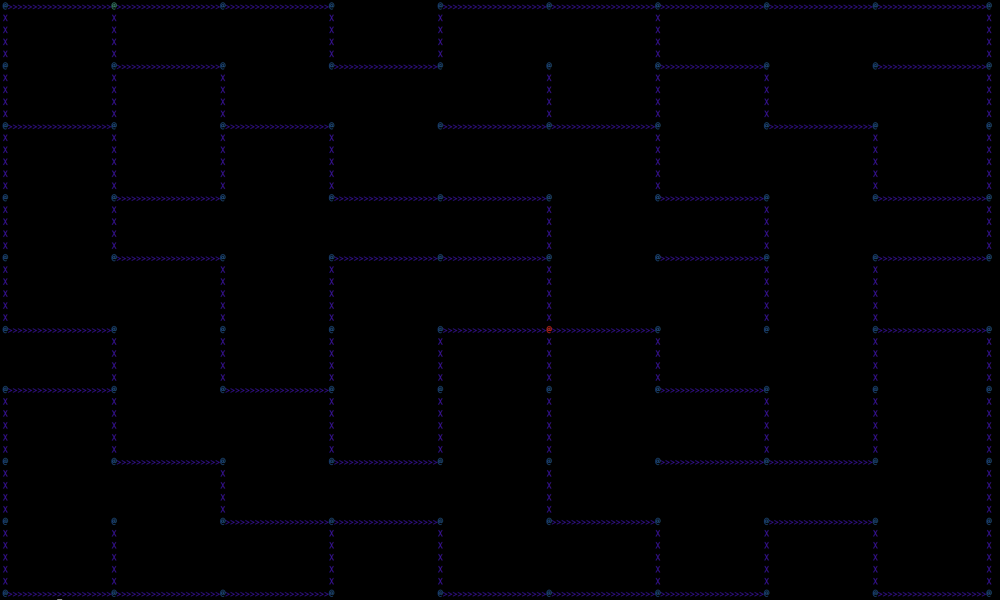
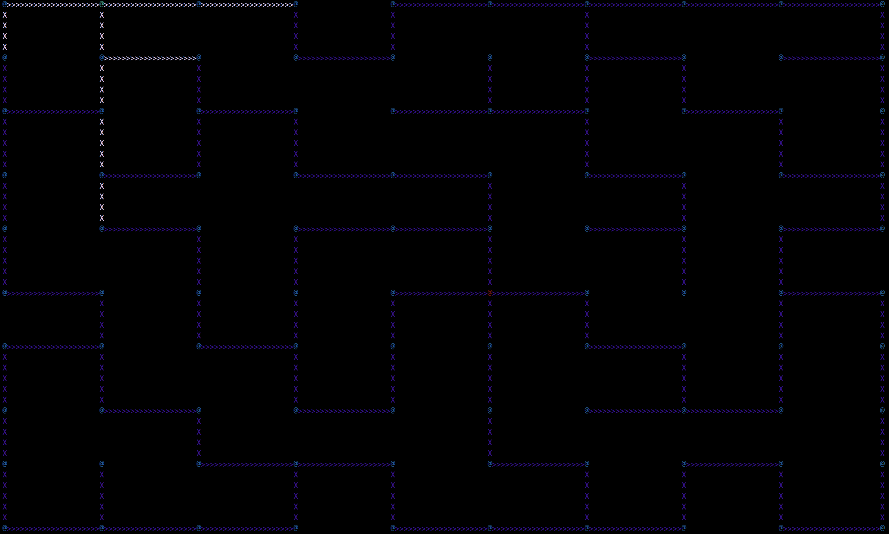
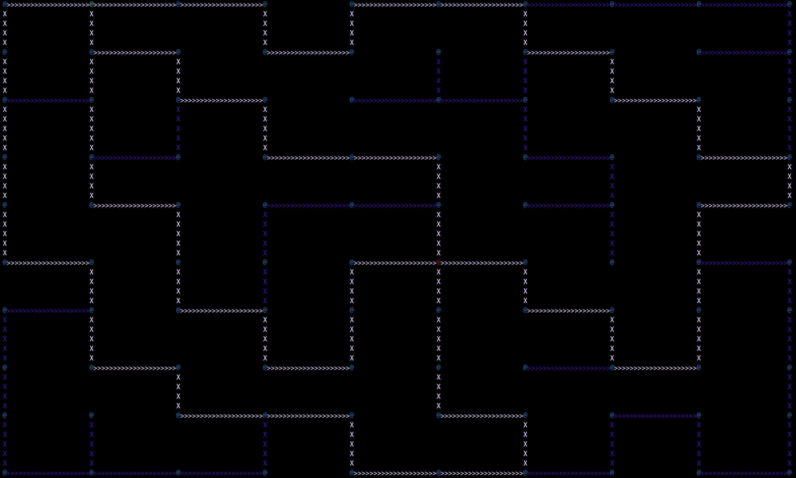
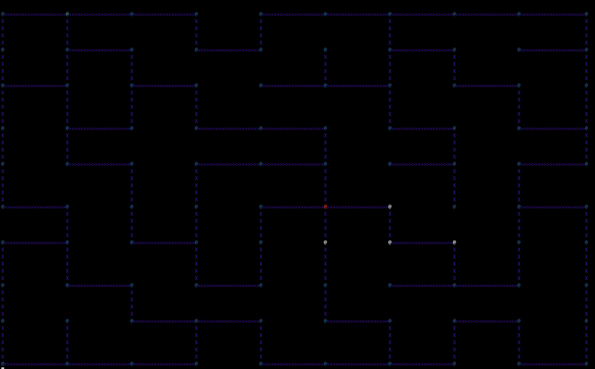

# lem_in
A pathing device for ants, with Tomas Diaz

We implemented an algorithm to solve a variant of the maximum flow problem on a graph with unit capacity edges where the bottleneck was at the vertices. One executable file outputs commands for each ant to a particular node in a given turn, btu a more understandable format is acheived by piping this output into our visualizer (pictured below). We tested a number of cases to ensure that our algorithm was always able to find the maximum number of simultaneously traversable paths under the constraints given.

